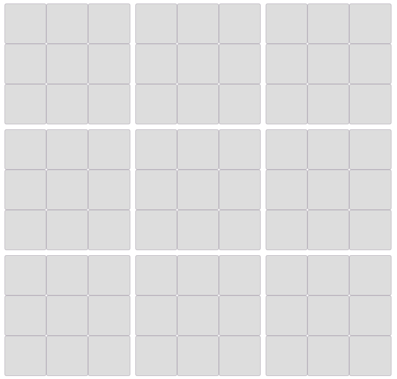
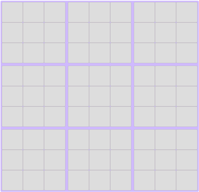
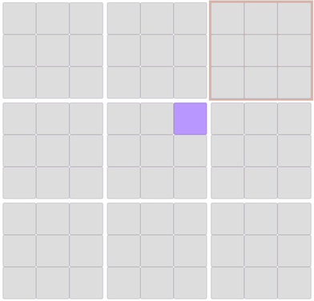
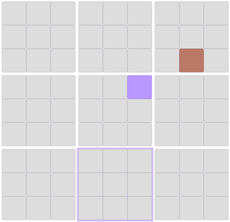
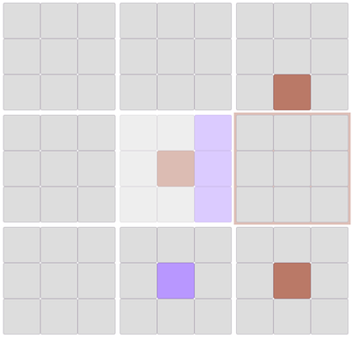
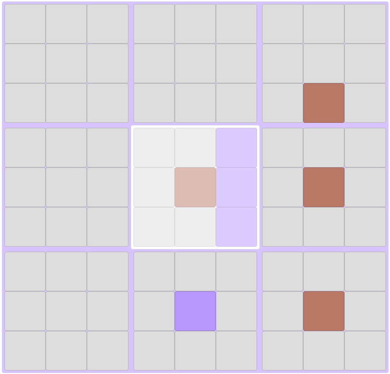
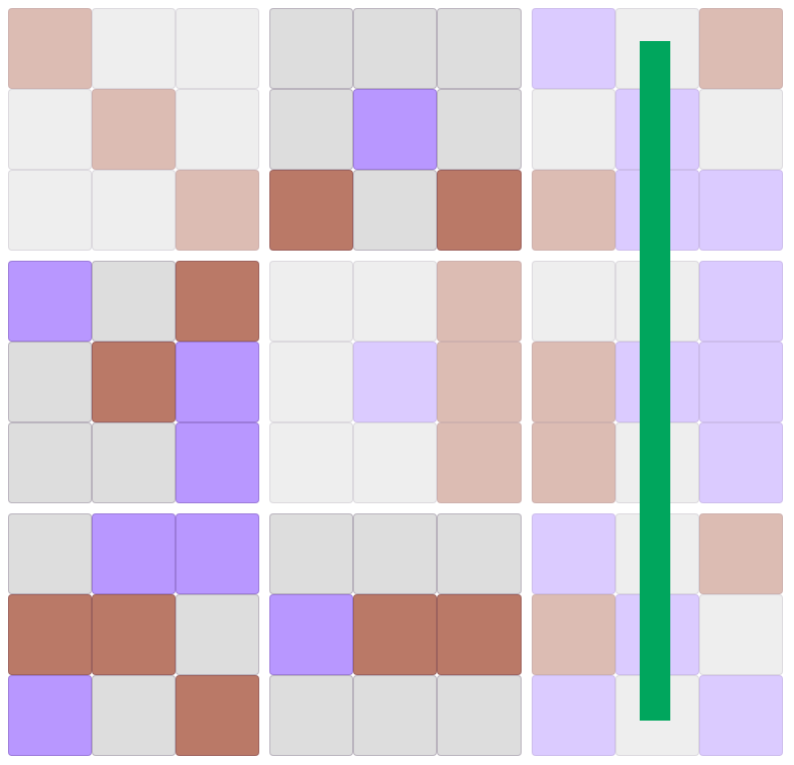

The Ultimate tic tac toe!

Play in [Here](https://ticitacatoe.herokuapp.com/) !!

## How to play?

### PLAYER

### About board

Ultimate tic-tac-toe is upgrade of tic-tac-toe!

> (3by3) by (3by3)

### Step1. First player's turn

First player can put it anywhere.

### Step2. Next players' turn (game rule)

But next player is determined by where the first player is placed.

For example, first player was put it on the **top right of a small board**.

Then, next player cna put it on the **top right of a large board**.

### Step3. 

From now on, it continues like this.

### Step4. An exceptional situation occurs

If you have to move to the block that the owner already has,

### Step5. 

then you can put it anywhere!

### Step6. Winning conditions

In this way, Winner who made one line first based on a large block.

