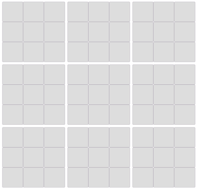

The Ultimate tic tac toe!

Play in [Here](https://ticitacatoe.herokuapp.com/) !!

## How to play?

Ultimate tic-tac-toe is upgrade of tic-tac-toe!

> (3by3) by (3by3)

First player can put it anywhere.

But next player is determined by where the first player is placed.

For example, first player was put it on the **top right of a small board**.

Then, next player cna put it on the **top right of a large board**.

From now on, it continues like this.

If you have to move to the block that the owner already has,

then you can put it anywhere!

In this way, Winner who made one line first based on a large block.

## 

<!-- ## TODO
- 게임 떠날때 알림
-->